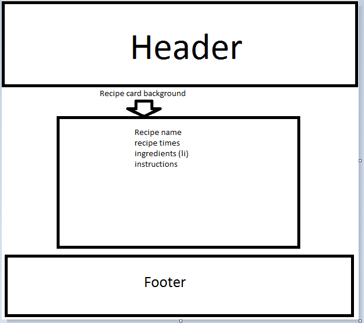

# Planning

## Table planning:

### table recipes-
recipename: "string",
cookingtime: integer,
preptime: integer,
instructions: "string",
ingredients: ingredientsId

### table ingredients-
ingredientName: "string",
amount: "string",
recipe: recipeId,

## Route planning
### table 1 routes (recipes)
index - lists recipes
show - shows the individual recipe and lists ingredients associated with recipe (get here by clicking the recipe on the home page)
new - create a new recipe (get here from the home page)
edit - edit the recipe (get here from selecting a recipe from the home page)

### table 2 routes (ingredients)
show - shows the ingredient selected (get here from the recipe)
edit - edit the ingredient selected (get here from the ingredient show view)
new - add an ingredient to the recipe selected (get here from the ingredient show view)

## wireframe

## MVP
create an app that has a table of recipes that is linked to a table on ingredients. Have full CRUD on both. Access the ingredients table from the recipe table. a recipe can have many ingredients.

## Goals
### Bronze
Have the page render on the browser and be deployed.

### Silver - achieved
Have styling with bright colour and a background for the recipe to show up on. get the recipe to properly lay on the recipe card.

### Gold
Have a dropdown menu for the add/edit recipes/ingredients. have a modal show up when you view the recipe/ingredient.