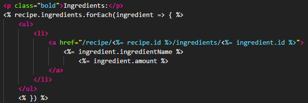

# WDI Project 2
https://thawing-crag-57691.herokuapp.com/

## Motivation
For our second project we were tasked with creating an express app that uses two tables that join together. I created a recipe app where there is full CRUD on both tables. The tables join together to provide you the information on them and render on the page.

## Code Used
* EJS
* CSS
* JSON
* JavaScript
* Node

## Node Packages
* body-parser
* dotenv
* ejs
* express
* heroku
* method-override
* pg
* pg-hstore
* sequelize

## Code Example

## How to use
Get on the home page and you are greeted by a list of recipes that are on the database. When you click on the recipe name you are brought to the page where it shows the information for the recipe. The information for the recipe includes the ingredients that belong to that recipe which comes from the second table in the database. From this page you can edit and delete the recipe or add an ingredient. To edit or delete an ingredient simply click on it and click the correct button.You can at any point click on the header or the home button in the footer to go back to the list of recipes. On the home page you can also click to add a new recipe.

## Copyright info:
&copy; Simon Albani, 2018
